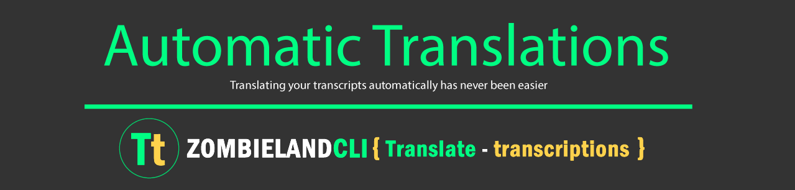

## Introduction

Generate translations for transcripts your videos into many languages automatically, using the power of AWS Cloud Computing technologies (Amazon Web Services) you can enjoy in your favorite language and with the control of each time section the content of the video . A perfect way to avoid missing relevant data from your multimedia content.

## About Project

This project is developed as a final presentation of 9 months of fundamentals at Holberton School, where we implement different mechanics to solve a specific problem regarding Design (architecture) and programming..

For this project we were working on a Skillshare client need, where we were for several sessions sharing and developing the product to the satisfaction of the client.

This project has a great purpose for the three members of the ZOMBLIELANDCLI team (Carlos Garc�a, Leonardo Calder�n and Iv�n Lasso), which allows them to put into practice their skills from what they have learned in fundamentals and to be able to be used as a productive sample in our personal portfolio.

## About Product

The main objective of the project is to generate the translation of an existing transcription, which belongs to a video course on the Skillshare.com platform, by default the transcription is in the original language of the video (English), but will give the user the option to select a language and automatically generate the translation for transcription. And with this same transcript you can navigate between the subtitles and tracks of the video.

## Content

- [Landing Page](/https://agzsoftsi.github.io/Automatic_Translations/)
- [FrontEnd](/FrontEnd)
- [BackEnd](/BackEnd)
- [API](/API)
- [Documents](/Documents)

## Program Overview

> - The video is in native language (English), and it is stored in an S3 (Amazon simple storage service).

> - The transcript of the video is in the native language (English), and it is stored in an S3 (Amazon simple storage service).

> - The user from the Frontend will be able to define the language in which he wants to see the transcript using a language selector. (For this demo version, we only use 5 languages, but many more can be used).

> - The transcript has a link to the video tracks, which facilitates the interaction between its different sections, what is reproduced in the video and what is read in the transcript.

> - The transcript has two presentations, a stardard from each subtitle with its start time, and a paragraph where the subtitles are grouped into intervals according to the transcript.

> - The aesthetics and some elements of the demo are inspired by the skillshare.com platform, who is the client, and the integration is expected to be using that view.

> - The API that the Fronted communicates with the Backend is developed with another AWS technology called API Gateway, which manages the ideal integration for this demo.

> - In the Backend another AWS technology called Lambda is implemented, which allows creating functions that process frontend requests (Microservices) and that have been duly linked by the API Gateway. AWS Lambda processes the transcript, sends it to Translate using AWS translate, Stores the Translated Translation in a new File in an S3, which works as a cache type, and returns the response to the part frontend that is consumed by means of a JSON.
Originally The transcript file is an .srt (text) and but in the response it becomes a JSON.

> - In the Backend another AWS technology called Lambda is implemented, which allows creating functions that process frontend requests (Microservices) and that have been duly linked by the API Gateway. AWS Lambda processes the transcript, sends it to Translate using AWS translate, Stores the Translated Translation in a new File in an S3, which works as a cache type, and returns the response to the part frontend that is consumed by means of a JSON.

## MVP Architecture

## Technologies

## :sagittarius: Author

> :man: Carlos Andres Garcia Morales

> :e-mail: [E-mail](agzsoftsi@gmail.com)

> :octocat: [Github](https://github.com/agzsoftsi)

> :bird: [Twiiter](https://twitter.com/karlgarmor)

> :blue_book: [Linkedin](https://twitter.com/karlgarmor)

> :globe_with_meridians: [WebPage](https://www.agzsoftsi.tech/)

